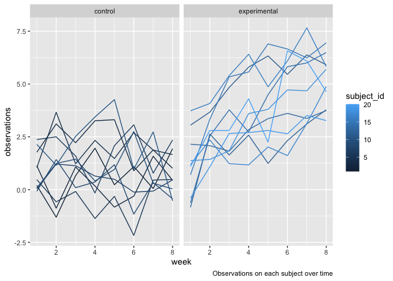

Homework 5 \| Onyeka Isamah \| oi2142
================

# Problem 1

-   Cleaning the data, creating `city_state` and `resolution` variables:

``` r
homicide_df = read_csv("./homicide-data.csv", na = c("", "Unknown")) %>% 
  mutate(city_state = str_c(city, state),
         resolution = case_when(
           disposition == "Closed without arrest" ~ "unsolved",
           disposition == "Open/No arrest" ~ "unsolved",
           disposition == "Closed by arrest" ~ "solved"
         )) %>% 
  relocate(city_state) %>% 
  filter(city_state != "TulsaAL")
```

The **raw data set** has **14** variables and **52178** observations.
Variables include `uid`, `reported_date`, `victim_last`, `victim_first`,
`victim_race`, `victim_age`, `victim_sex`, `city`, `state`, `lat`,`lon`,
and `disposition`.

-   Focusing on Baltimore to estimate the proportion of unsolved
    homicides.

``` r
baltimore_df =
  homicide_df %>% filter(city_state == "BaltimoreMD")


baltimore_summary = baltimore_df %>% summarize(
  unsolved = sum(resolution == "unsolved"),
  n = n()
)
 
baltimore_test = 
  prop.test(
   x = baltimore_summary %>% pull(unsolved),
   n=  baltimore_summary %>%pull(n))
 

baltimore_test %>% 
  broom::tidy() %>%  knitr::kable()
```

|  estimate | statistic | p.value | parameter |  conf.low | conf.high | method                                               | alternative |
|----------:|----------:|--------:|----------:|----------:|----------:|:-----------------------------------------------------|:------------|
| 0.6455607 |   239.011 |       0 |         1 | 0.6275625 | 0.6631599 | 1-sample proportions test with continuity correction | two.sided   |

-   Iterating across cities:

``` r
prop_test_function = 
  function(city_df) {
    
    city_summary = 
      city_df %>% 
      summarize(
      unsolved = sum(resolution == "unsolved"),
             n = n()
)
 
    city_test = 
      prop.test(
        x = city_summary %>% pull(unsolved),
        n =  city_summary %>%pull(n))
    
    return(city_test)
  }

prop_test_function(baltimore_df)
```

    ## 
    ##  1-sample proportions test with continuity correction
    ## 
    ## data:  city_summary %>% pull(unsolved) out of city_summary %>% pull(n), null probability 0.5
    ## X-squared = 239.01, df = 1, p-value < 2.2e-16
    ## alternative hypothesis: true p is not equal to 0.5
    ## 95 percent confidence interval:
    ##  0.6275625 0.6631599
    ## sample estimates:
    ##         p 
    ## 0.6455607

``` r
homicide_df %>% 
  filter(
    city_state == "AlbuquerqueNM"
  ) %>%  prop_test_function()
```

    ## 
    ##  1-sample proportions test with continuity correction
    ## 
    ## data:  city_summary %>% pull(unsolved) out of city_summary %>% pull(n), null probability 0.5
    ## X-squared = 19.114, df = 1, p-value = 1.232e-05
    ## alternative hypothesis: true p is not equal to 0.5
    ## 95 percent confidence interval:
    ##  0.3372604 0.4375766
    ## sample estimates:
    ##         p 
    ## 0.3862434

-   Iterating across all cities.

``` r
results_df = 
  homicide_df %>% 
  nest(data = uid:resolution) %>% 
  mutate(
    test_results = map(data, prop_test_function),
    tidy_results = map(test_results, broom::tidy)
  ) %>% 
  select(city_state, tidy_results) %>% 
  unnest(tidy_results) %>% 
  select(city_state, estimate, starts_with("conf"))
```

### Plot showing estimates and confidence intervals

<!-- -->

# Problem 2

Subjects in the control group seems to have steady observations over the
weeks. In comparison, the experimental arm appears to have rising
observations over the course of the 8 weeks. Overall, the experimental
group appears to have higher observations over time compared to the
comparison group.

<!-- -->

# Problem 3:

Replacing the missing numeric variables with the column mean and
replacing missing character variable, species, with *virginica*.

| sepal\_length | sepal\_width | petal\_length | petal\_width | species   |
|--------------:|-------------:|--------------:|-------------:|:----------|
|      5.100000 |     3.500000 |      1.400000 |     0.200000 | setosa    |
|      4.900000 |     3.000000 |      1.400000 |     0.200000 | setosa    |
|      4.700000 |     3.200000 |      1.300000 |     0.200000 | setosa    |
|      4.600000 |     3.100000 |      1.500000 |     1.192308 | setosa    |
|      5.000000 |     3.600000 |      1.400000 |     0.200000 | setosa    |
|      5.400000 |     3.900000 |      1.700000 |     0.400000 | setosa    |
|      5.819231 |     3.400000 |      1.400000 |     0.300000 | setosa    |
|      5.000000 |     3.400000 |      1.500000 |     0.200000 | setosa    |
|      4.400000 |     2.900000 |      1.400000 |     0.200000 | setosa    |
|      4.900000 |     3.100000 |      3.765385 |     0.100000 | setosa    |
|      5.400000 |     3.075385 |      1.500000 |     0.200000 | setosa    |
|      4.800000 |     3.400000 |      1.600000 |     0.200000 | setosa    |
|      5.819231 |     3.075385 |      1.400000 |     0.100000 | setosa    |
|      4.300000 |     3.000000 |      3.765385 |     0.100000 | setosa    |
|      5.819231 |     4.000000 |      3.765385 |     0.200000 | setosa    |
|      5.700000 |     4.400000 |      1.500000 |     0.400000 | setosa    |
|      5.400000 |     3.900000 |      1.300000 |     0.400000 | setosa    |
|      5.100000 |     3.500000 |      1.400000 |     1.192308 | setosa    |
|      5.700000 |     3.800000 |      1.700000 |     0.300000 | setosa    |
|      5.100000 |     3.800000 |      1.500000 |     1.192308 | setosa    |
|      5.400000 |     3.400000 |      1.700000 |     0.200000 | setosa    |
|      5.100000 |     3.700000 |      1.500000 |     0.400000 | virginica |
|      4.600000 |     3.600000 |      1.000000 |     0.200000 | setosa    |
|      5.819231 |     3.300000 |      3.765385 |     0.500000 | setosa    |
|      4.800000 |     3.400000 |      1.900000 |     0.200000 | virginica |
